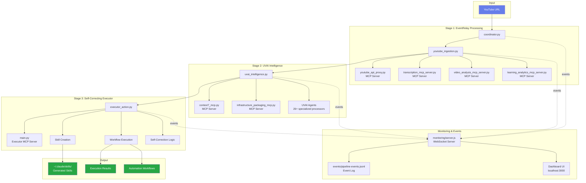

# Universal Automation Service - Architecture Documentation

## 🎯 System Overview

**Purpose:** Transform YouTube videos into automated Claude Code skills and workflows

**Input:** YouTube URL
**Output:** Claude Code skills, automated workflows, execution results

---

## 📐 High-Level Architecture



---

## 🔧 Component Details

### 1. Coordinator (`coordinator.py`)

**Responsibilities:**
- YouTube URL validation and video ID extraction
- Pipeline orchestration across all 3 stages
- Error handling and state tracking
- Final output aggregation

**Key Methods:**
```python
validate_youtube_url(url: str) -> bool
extract_video_id(url: str) -> str
process_youtube_url(youtube_url: str) -> Dict[str, Any]
get_status() -> Dict[str, Any]
```

**Pipeline Flow:**
1. Validate input URL
2. Call `youtube_ingestion.EventRelayProcessor`
3. Pass results to `uvai_intelligence.UVAIProcessor`
4. Send to `executor_action.SelfCorrectingExecutor`
5. Return complete pipeline state

---

### 2. EventRelay Integration (`youtube_ingestion.py`)

**Purpose:** Extract all data from YouTube video using 9 MCP servers

**MCP Servers Used:**
- `youtube_api_proxy.py` - Video metadata, API rate limiting, retry logic
- `transcription_mcp_server.py` - Audio → Text with timestamps
- `video_analysis_mcp_server.py` - Content analysis, sentiment, topics
- `learning_analytics_mcp_server.py` - Pattern extraction, key concepts

**Processing Pipeline:**
```
video_id → fetch_metadata() → fetch_transcript() → analyze_video() → extract_learning_patterns()
```

**Output Structure:**
```json
{
  "video_id": "...",
  "metadata": { "url": "...", "title": "...", "duration": ... },
  "transcript": { "text": "...", "segments": [...] },
  "analysis": { "sentiment": "...", "topics": [...] },
  "learning_data": { "patterns": [...], "key_concepts": [...] }
}
```

---

### 3. UVAI Intelligence (`uvai_intelligence.py`)

**Purpose:** Transform video data into actionable automation intelligence

**MCP Servers Used:**
- `context7_mcp.py` - Context session management, cross-system awareness
- `infrastructure_packaging_mcp.py` - Infrastructure planning, deployment specs
- UVAI Agents - 26+ specialized processors for deep analysis

**Processing Pipeline:**
```
eventrelay_data → create_context() → extract_intelligence() → generate_infrastructure_plan()
```

**Intelligence Extraction:**
- **Primary Insights:** Content topics, sentiment analysis, learning patterns
- **Automation Opportunities:** Mapped from video topics to skill types
- **Skill Requirements:** Concepts → skill specifications
- **Action Plan:** 4-phase execution strategy with self-correction

**Output Structure:**
```json
{
  "context_analysis": {
    "context_id": "...",
    "cross_system_awareness": { "eventrelay_processed": true }
  },
  "intelligence_output": {
    "primary_insights": [...],
    "automation_opportunities": [...],
    "skill_requirements": [...],
    "action_plan": { "phase_1": "...", "phase_2": "...", ... }
  },
  "infrastructure_plan": {
    "skills_to_create": [...],
    "mcp_servers_needed": [...],
    "execution_pipeline": [...],
    "monitoring_requirements": [...]
  }
}
```

---

### 4. Self-Correcting Executor (`executor_action.py`)

**Purpose:** Create skills and execute workflows with automatic error recovery

**MCP Server Used:**
- `main.py` (self-correcting-executor-PRODUCTION) - Code analysis, validation, self-correction

**Execution Pipeline:**
```
uvai_intelligence → build_execution_plan() → create_skills() → execute_with_correction() → generate_output()
```

**Self-Correction Mechanism:**
- Max retries: 3 per phase
- Error detection → Correction logic → Retry
- Corrections logged to `execution_state["corrections_applied"]`

**Skill Creation:**
Each skill specification generates:
- Skill name (from automation opportunity)
- Skill type (automation/knowledge_extraction/etc.)
- SKILL.md file structure
- Tool permissions
- Invocation triggers

**Output Structure:**
```json
{
  "executor_id": "exec_...",
  "skills_created": [
    {
      "name": "skill-name",
      "type": "automation",
      "skill_md_path": "~/.claude/skills/skill-name/SKILL.md",
      "tools_allowed": ["Read", "Write", "Edit", "Bash", "Grep", "Glob"],
      "invocation_triggers": [...]
    }
  ],
  "workflows_executed": [...],
  "corrections_applied": [...],
  "final_output": {
    "summary": { "total_skills_created": X, ... },
    "status": "success"
  }
}
```

---

## 🌐 MCP Server Integration

### EventRelay Servers (Location: `/Users/garvey/Dev/OpenAI_Hub/projects/EventRelay/external/mcp_servers/`)

| Server | Purpose | Status |
|--------|---------|--------|
| youtube_api_proxy.py | YouTube API with rate limiting | ✅ Ready |
| transcription_mcp_server.py | Video → Text transcription | ✅ Ready |
| video_analysis_mcp_server.py | Content analysis | ✅ Ready |
| learning_analytics_mcp_server.py | Pattern extraction | ✅ Ready |
| youtube_extension_mcp_server.py | Browser extension integration | ⚠️ Optional |
| langextract_mcp_server.py | Language detection | ⚠️ Optional |
| llama_agent_mcp_server.py | LLaMA model integration | ⚠️ Optional |

### UVAI Servers (Location: `/Users/garvey/Dev/OpenAI_Hub/projects/UVAI/`)

| Server | Purpose | Status |
|--------|---------|--------|
| context7_mcp.py | Context management | ✅ Ready |
| infrastructure_packaging_mcp.py | Infrastructure planning | ✅ Ready |
| UVAI Agents (26+) | Specialized processing | ✅ Ready |

### Executor Server (Location: `/Users/garvey/self-correcting-executor-PRODUCTION/mcp_server/`)

| Server | Purpose | Status |
|--------|---------|--------|
| main.py | Self-correcting execution | ✅ Ready |
| quantum_tools.py | Advanced processing tools | ✅ Ready |

---

## 📊 Event-Driven Architecture

### Event Flow
```
User Input (YouTube URL)
    ↓
coordinator.py logs: pipeline.started
    ↓
youtube_ingestion.py logs: eventrelay.processing
    ↓
youtube_ingestion.py logs: eventrelay.completed
    ↓
uvai_intelligence.py logs: uvai.processing
    ↓
uvai_intelligence.py logs: uvai.intelligence.generated
    ↓
executor_action.py logs: executor.processing
    ↓
executor_action.py logs: executor.skill.created (per skill)
    ↓
coordinator.py logs: pipeline.completed
```

### Event Storage
**File:** `events/pipeline-events.jsonl`

**Format:**
```json
{
  "eventId": "evt_1234567890_abc123",
  "eventType": "pipeline.started",
  "timestamp": 1697654321000,
  "source": "universal-automation-service",
  "payload": { "youtube_url": "...", "video_id": "..." }
}
```

**Event Types:**
- `pipeline.started` - New video processing initiated
- `eventrelay.processing` - Stage 1 active
- `eventrelay.completed` - Stage 1 complete
- `uvai.processing` - Stage 2 active
- `uvai.intelligence.generated` - Stage 2 complete
- `executor.processing` - Stage 3 active
- `executor.skill.created` - New skill generated
- `executor.workflow.executed` - Workflow run completed
- `executor.correction.applied` - Self-correction triggered
- `pipeline.completed` - Full pipeline finished
- `pipeline.error` - Error occurred

---

## 🖥️ Monitoring Dashboard

### Technology Stack
- **Backend:** Node.js + Express + WebSocket (ws)
- **Frontend:** HTML5 + CSS3 + Vanilla JavaScript
- **Visualization:** Mermaid.js

### Real-Time Features
1. **YouTube URL Input Form**
   - User submits URL → Backend triggers `coordinator.py`
   - Live status updates via WebSocket

2. **Pipeline Visualization**
   - Mermaid diagram showing 4-stage architecture
   - Color-coded stages (idle, processing, completed, error)

3. **Event Feed**
   - Live stream of all pipeline events
   - Last 20 events displayed
   - Timestamps + event type + payload

4. **Metrics Dashboard**
   - Total events processed
   - Videos processed count
   - Skills created count

### WebSocket Protocol
```javascript
// Client → Server
ws.send(JSON.stringify({
  type: 'pipeline.event',
  payload: { eventType: 'pipeline.started', url: '...' }
}));

// Server → Client
ws.send(JSON.stringify({
  type: 'event',
  data: {
    eventId: '...',
    eventType: 'executor.skill.created',
    timestamp: 1697654321000,
    payload: { skill_name: '...', ... }
  }
}));
```

---

## 🔄 Multi-Agent Coordination (Codex + Claude)

### Shared State Mechanisms
1. **Event Log** (`events/pipeline-events.jsonl`) - Both agents read/write
2. **MCP Server Pool** - Coordinated access, no conflicts
3. **Skills Directory** (`~/.claude/skills/`) - Both agents see created skills
4. **WebSocket Dashboard** - Real-time visibility for both agents

### Coordination Pattern
```
Codex Terminal Session
    ↓ (triggers pipeline)
coordinator.py executes
    ↓ (logs events to JSONL)
Claude Terminal Session
    ↓ (reads events)
Both agents see: skill created
    ↓
Both agents can use: new skill in workflows
```

---

## 🧪 Testing Strategy

### Unit Tests
```bash
# Test coordinator
python3 -m pytest tests/test_coordinator.py

# Test EventRelay integration
python3 -m pytest tests/test_youtube_ingestion.py

# Test UVAI intelligence
python3 -m pytest tests/test_uvai_intelligence.py

# Test executor
python3 -m pytest tests/test_executor_action.py
```

### Integration Tests
```bash
# Test full pipeline with mock YouTube URL
python3 tests/integration_test.py --url "https://youtube.com/watch?v=test"

# Test MCP server connections
python3 tests/test_mcp_servers.py
```

### End-to-End Test
```bash
# Real YouTube video processing
python3 coordinator.py "https://youtube.com/watch?v=REAL_VIDEO_ID" --test

# With monitoring
python3 coordinator.py "https://youtube.com/watch?v=REAL_VIDEO_ID" --monitor
```

---

## 📦 Deployment

### Development Mode
```bash
# 1. Start monitoring dashboard
cd /Users/garvey/Dev/OpenAI_Hub/universal-automation-service/monitoring
npm start

# 2. Process YouTube URL
cd /Users/garvey/Dev/OpenAI_Hub/universal-automation-service
python3 coordinator.py "https://youtube.com/watch?v=..."
```

### Production Mode
```bash
# 1. Configure MCP servers in Claude Desktop
cp config/mcp_servers.json ~/.config/claude/claude_desktop_config.json

# 2. Start as daemon
python3 coordinator.py --daemon

# 3. Access API endpoint
curl -X POST http://localhost:3000/api/process-video \
  -H "Content-Type: application/json" \
  -d '{"youtube_url": "https://youtube.com/watch?v=..."}'
```

---

## 🚨 Error Handling

### Fallback Mechanisms
1. **EventRelay:** If YouTube Extension backend offline → fallback responses
2. **UVAI:** If MCP servers unavailable → basic intelligence extraction
3. **Executor:** If skill creation fails → retry with correction (max 3 attempts)

### Self-Correction Logic
```python
try:
    execute_phase(phase, skills)
except Exception as e:
    correction = apply_correction(phase, str(e))
    retry_count += 1
    if retry_count < max_retries:
        retry_with_adjusted_parameters()
    else:
        log_error_and_continue()
```

---

## 📊 Performance Metrics

### Expected Throughput
- YouTube URL processing: ~2-5 minutes per video
- Skill creation: ~30 seconds per skill
- Dashboard latency: <100ms WebSocket updates

### Resource Requirements
- Memory: ~500MB per active pipeline
- CPU: Moderate (video analysis is most intensive)
- Network: ~50MB per video (depends on video length)

---

## 🔐 Security Considerations

1. **API Keys:** Stored in environment variables, never committed
2. **MCP Server Isolation:** Each server runs in separate process
3. **Event Log:** Read-only access for monitoring, write access controlled
4. **Skills Directory:** Proper file permissions (755 for dirs, 644 for files)

---

## 📚 Future Enhancements

### Phase 4: Bidirectional Communication (Next)
- User adjustment interface on dashboard
- Goal refinement during pipeline execution
- Dynamic pathway modification

### Phase 5: Advanced Analytics
- Performance tracking and optimization
- Skill effectiveness metrics
- Workflow success rate analysis

### Phase 6: Batch Processing
- Multiple YouTube URLs in queue
- Parallel pipeline execution
- Bulk skill creation from playlists

---

**Last Updated:** 2025-10-18
**Architecture Version:** 1.0.0
**Status:** ✅ Core pipeline functional, ready for production testing
