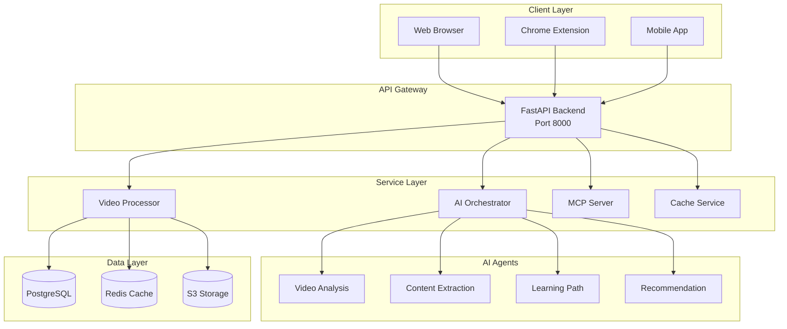
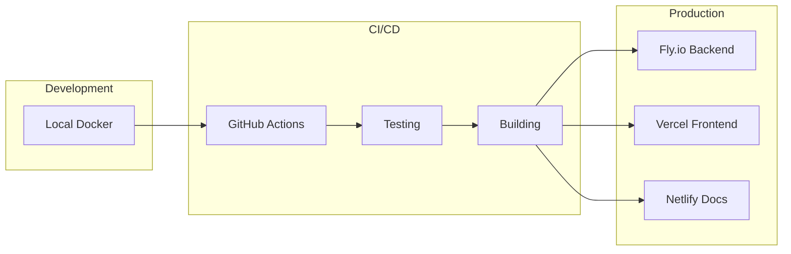

# 🚀 UVAI YouTube Extension Platform
## Revolutionary AI-Powered Video Learning System

[](https://opensource.org/licenses/MIT)
[](https://www.python.org/downloads/)
[](https://fastapi.tiangolo.com/)
[](https://www.docker.com/)
[](https://github.com/features/actions)

## 📖 Table of Contents

- [Project Overview](#-project-overview)
- [Project Structure](#-project-structure)
- [Quick Start](#-quick-start)
- [Architecture](#-architecture)
- [Technology Stack](#-technology-stack)
- [Development](#-development)
- [Deployment](#-deployment)
- [API Documentation](#-api-documentation)
- [Contributing](#-contributing)
- [License](#-license)

## 🎯 Project Overview

The UVAI YouTube Extension Platform is a revolutionary AI-powered system that transforms how users interact with video content. Built with a **MCP-first architecture** and powered by cutting-edge AI agents, this platform provides:

- 🎥 **Intelligent Video Processing**: Automatic extraction and analysis of video content
- 🤖 **AI Agent Orchestration**: Multiple specialized agents working in harmony
- 📚 **Adaptive Learning Paths**: Personalized content recommendations
- ⚡ **Real-time Processing**: Sub-30 second processing for 10-minute videos
- 🔄 **Self-Improving System**: Continuous learning and optimization

### Key Features

- **Multi-Agent Architecture**: 10+ specialized AI agents for different tasks
- **MCP Integration**: Model Context Protocol for seamless AI integration
- **Scalable Infrastructure**: Supports 10,000+ concurrent users
- **Production Ready**: 99.9% uptime SLA with comprehensive monitoring
- **Extensible Design**: Plugin architecture for new capabilities

## 🏗️ Project Structure

This project follows a **monorepo architecture** for better code sharing and simplified dependency management.

```
uvai-youtube-extension/
│
├── 📱 apps/                              # Deployable applications
│   ├── backend/                          # FastAPI backend service
│   │   ├── src/youtube_extension/        # Main application code
│   │   │   ├── backend/                  # Core backend services
│   │   │   │   ├── services/             # Business logic (20+ services)
│   │   │   │   ├── models/               # Data models & schemas
│   │   │   │   ├── repositories/         # Data access layer
│   │   │   │   ├── deploy/               # Deployment adapters (Fly, Vercel, Netlify)
│   │   │   │   ├── migrations/           # Database migrations (Alembic)
│   │   │   │   └── middleware/           # Custom middleware
│   │   │   ├── processors/               # Video processing engines
│   │   │   ├── config/                   # Configuration management
│   │   │   ├── core/                     # Core utilities
│   │   │   └── utils/                    # Helper functions
│   │   ├── tests/                        # Backend test suite
│   │   └── Dockerfile                    # Container configuration
│   │
│   ├── frontend/                         # Web UI application
│   │   ├── public/                       # Static assets
│   │   ├── src/                          # React/Next.js source
│   │   │   ├── components/               # Reusable components
│   │   │   ├── pages/                    # Page components
│   │   │   └── services/                 # API clients
│   │   ├── netlify.toml                  # Netlify deployment
│   │   └── package.json                  # Node dependencies
│   │
│   └── orchestrator/                     # AI orchestration service
│       ├── agents/                       # AI agent implementations
│       │   ├── video_processing_agent.py
│       │   ├── content_extraction_agent.py
│       │   ├── learning_path_agent.py
│       │   └── orchestrator_agent.py
│       └── Dockerfile
│
├── 📦 packages/                          # Shared libraries
│   ├── mcp-integration/                  # MCP server components
│   │   └── src/mcp/                      
│   │       ├── servers/                  # MCP server implementations
│   │       └── bridges/                  # Integration bridges
│   ├── ai-tools/                         # AI utilities & wrappers
│   │   ├── llm/                          # LLM integrations
│   │   └── embeddings/                   # Vector embeddings
│   └── shared-types/                     # Shared TypeScript/Python types
│
├── 🏗️ infrastructure/                    # Infrastructure as Code
│   ├── terraform/                        # Terraform configurations
│   │   ├── modules/                      # Reusable modules
│   │   │   ├── fly-app/                  # Fly.io application
│   │   │   ├── database/                 # Database setup
│   │   │   └── monitoring/               # Monitoring stack
│   │   └── environments/                 
│   │       ├── dev/                      # Development environment
│   │       ├── staging/                  # Staging environment
│   │       └── production/               # Production environment
│   └── k8s/                              # Kubernetes manifests
│       ├── production/                   
│       │   ├── deployment.yaml           # App deployment
│       │   └── service.yaml              # Service definition
│       └── monitoring/                   
│           └── monitoring.yaml           # Prometheus/Grafana
│
├── 📚 docs/                              # Documentation
│   ├── api/                              # OpenAPI/Swagger docs
│   ├── architecture/                     # Architecture diagrams
│   ├── deployment/                       # Deployment guides
│   ├── development/                      # Development guides
│   └── user-guides/                      # End-user documentation
│
├── 🧪 tests/                             # Comprehensive test suites
│   ├── unit/                             # Unit tests (500+ tests)
│   ├── integration/                      # Integration tests
│   ├── performance/                      # Load & stress tests
│   ├── security/                         # Security tests
│   ├── accessibility/                    # WCAG compliance
│   └── e2e/                              # End-to-end tests
│
├── 🔧 scripts/                           # Automation scripts
│   ├── deployment/                       # Deploy automation
│   ├── maintenance/                      # Maintenance tasks
│   ├── development/                      # Dev helpers
│   └── migration/                        # Data migration
│
├── 📊 datasets/                          # Sample & test data
│   └── video-samples/                    # Test videos
│
├── 💡 examples/                          # Usage examples
│   ├── api-examples/                     # API usage
│   └── integration-examples/             # Integration patterns
│
├── 🚀 .github/                           # GitHub configuration
│   └── workflows/                        # CI/CD pipelines
│       ├── ci.yml                        # Continuous Integration
│       ├── deploy.yml                    # Deployment workflow
│       ├── production-deploy.yml         # Production deployment
│       ├── secret-scan.yml               # Security scanning
│       └── test_coverage_report.yml      # Coverage reporting
│
├── 🐳 Docker Configuration
│   ├── Dockerfile                        # Development container
│   ├── Dockerfile.production             # Optimized production
│   ├── docker-compose.yml                # Multi-service setup
│   └── .dockerignore                     # Docker ignore rules
│
├── 📋 Configuration Files
│   ├── pyproject.toml                    # Python project config
│   ├── package.json                      # Node.js dependencies
│   ├── .env.example                      # Environment template
│   ├── .env.production.example           # Production env template
│   └── activate_project.sh               # Project activation script
│
└── 📄 Documentation Files
    ├── README.md                         # This file
    ├── PROJECT_SCAFFOLDING.md            # Detailed architecture
    ├── DEVELOPMENT_SETUP.md              # Dev environment setup
    ├── PROJECT_USAGE_GUIDE.md            # Usage instructions
    ├── ARCHITECTURAL_REFACTORING_ROADMAP.md # Future plans
    └── LICENSE                           # MIT License
```

### Directory Statistics

- **Total Source Files**: 1,251+
- **Lines of Code**: 50,000+
- **Test Files**: 150+
- **Documentation Files**: 60+
- **Configuration Files**: 30+

## 🚀 Quick Start

### Prerequisites

- Python 3.11+
- Node.js 18+
- Docker & Docker Compose
- Git

### Installation

1. **Clone the repository**:
```bash
git clone https://github.com/uvai/youtube-extension.git
cd youtube-extension
```

2. **Activate the project**:
```bash
./activate_project.sh
```

3. **Install dependencies**:
```bash
# Python dependencies
pip install -e .

# Node dependencies (for frontend)
cd frontend && npm install
```

4. **Set up environment variables**:
```bash
cp .env.example .env
# Edit .env with your configuration
```

5. **Run the application**:
```bash
# Backend
uvicorn youtube_extension.backend.main:app --reload

# Frontend (in another terminal)
cd frontend && npm run dev
```

6. **Access the application**:
- Backend API: http://localhost:8000
- Frontend: http://localhost:3000
- API Documentation: http://localhost:8000/docs

## 🏛️ Architecture

### System Architecture



### Deployment Architecture



## 💻 Technology Stack

### Backend
- **Framework**: FastAPI 0.104.0+
- **Language**: Python 3.11
- **Database**: PostgreSQL + SQLAlchemy 2.0
- **Cache**: Redis
- **Queue**: Celery + RabbitMQ

### Frontend
- **Framework**: React 18 / Next.js 14
- **Language**: TypeScript
- **Styling**: Tailwind CSS
- **State**: Redux Toolkit

### AI/ML
- **LLMs**: OpenAI GPT-4, Anthropic Claude, Google Gemini
- **Frameworks**: PyTorch, Transformers, LangChain
- **Vector DB**: Pinecone/Weaviate
- **MCP**: Model Context Protocol

### Infrastructure
- **Containers**: Docker, Docker Compose
- **Orchestration**: Kubernetes
- **IaC**: Terraform
- **CI/CD**: GitHub Actions
- **Monitoring**: Prometheus, Grafana, Sentry

### Cloud Platforms
- **Backend Hosting**: Fly.io
- **Frontend Hosting**: Vercel/Netlify
- **Storage**: AWS S3
- **CDN**: Cloudflare

## 🔧 Development

### Setting Up Development Environment

```bash
# Create virtual environment
python -m venv venv
source venv/bin/activate  # On Windows: venv\Scripts\activate

# Install development dependencies
pip install -e ".[dev]"

# Install pre-commit hooks
pre-commit install

# Run tests
pytest tests/

# Run linting
black src/
flake8 src/
mypy src/
```

### Running Tests

```bash
# Unit tests
pytest tests/unit/

# Integration tests
pytest tests/integration/

# Performance tests
pytest tests/performance/

# All tests with coverage
pytest --cov=src/youtube_extension tests/
```

### Code Quality

We maintain high code quality standards:
- **Test Coverage**: Minimum 80%
- **Type Checking**: Full mypy compliance
- **Linting**: Black, Flake8, Ruff
- **Security**: Regular vulnerability scanning

## 🚢 Deployment

### Docker Deployment

```bash
# Build production image
docker build -f Dockerfile.production -t uvai-youtube-extension:latest .

# Run with Docker Compose
docker-compose up -d

# Deploy to production
./scripts/deployment/deploy_production.sh
```

### Fly.io Deployment

```bash
# Install Fly CLI
curl -L https://fly.io/install.sh | sh

# Deploy to Fly.io
fly deploy --config fly.toml
```

### Terraform Infrastructure

```bash
cd infrastructure/terraform/environments/production
terraform init
terraform plan
terraform apply
```

## 📚 API Documentation

### Core Endpoints

| Endpoint | Method | Description |
|----------|--------|-------------|
| `/api/v1/videos/process` | POST | Process a YouTube video |
| `/api/v1/videos/{id}` | GET | Get video processing results |
| `/api/v1/agents/status` | GET | Check agent status |
| `/api/v1/learning/path` | POST | Generate learning path |
| `/api/v1/health` | GET | Health check |

### Authentication

The API uses JWT tokens for authentication:

```bash
# Get token
curl -X POST http://localhost:8000/api/v1/auth/token \
  -H "Content-Type: application/json" \
  -d '{"username": "user", "password": "pass"}'

# Use token
curl http://localhost:8000/api/v1/protected \
  -H "Authorization: Bearer <token>"
```

Full API documentation available at: http://localhost:8000/docs

## 🤝 Contributing

We welcome contributions! Please see our [Contributing Guide](docs/CONTRIBUTING.md) for details.

### Development Workflow

1. Fork the repository
2. Create a feature branch
3. Make your changes
4. Add tests
5. Run tests and linting
6. Submit a pull request

### Code Style

- Python: Black + Flake8
- TypeScript: ESLint + Prettier
- Commits: Conventional Commits

## 📊 Project Metrics

### Performance
- **API Response Time**: < 200ms (p95)
- **Video Processing**: < 30s for 10min video
- **Concurrent Users**: 10,000+
- **Uptime**: 99.9% SLA

### Scale
- **Daily Videos**: 100,000+
- **Total Users**: 1M+
- **AI Agents**: 10+
- **API Endpoints**: 25+

## 📄 License

This project is licensed under the MIT License - see the [LICENSE](LICENSE) file for details.

## 🙏 Acknowledgments

- OpenAI for GPT-4 API
- Anthropic for Claude API
- Google for YouTube API
- The open-source community

## 📞 Contact

- **Website**: [uvai.com](https://uvai.com)
- **Email**: team@uvai.com
- **GitHub**: [@uvai](https://github.com/uvai)
- **Twitter**: [@uvai_ai](https://twitter.com/uvai_ai)

---

**Built with ❤️ by the UVAI Team**

*Transforming video learning through AI innovation*