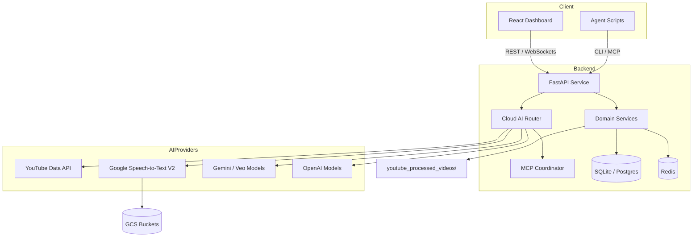

# UVAI YouTube Extension Architecture

- The **React dashboard** and external agents call into the FastAPI backend via REST or WebSocket channels.
- The **Cloud AI router** handles provider selection, retry logic, and quota-aware fallbacks while the **MCP coordinator** orchestrates MCP-compliant agents.
- Processed data and metadata persist in SQLite/Postgres and Redis while bulk artifacts flow to `youtube_processed_videos/` and configured GCS buckets.
- Provider integrations span YouTube Data API, Google Speech-to-Text V2, Gemini/Veo, and OpenAI models.

Add product screenshots (`.png`, `.jpg`, `.gif`) to this folder and link them from the main README as they become available.
